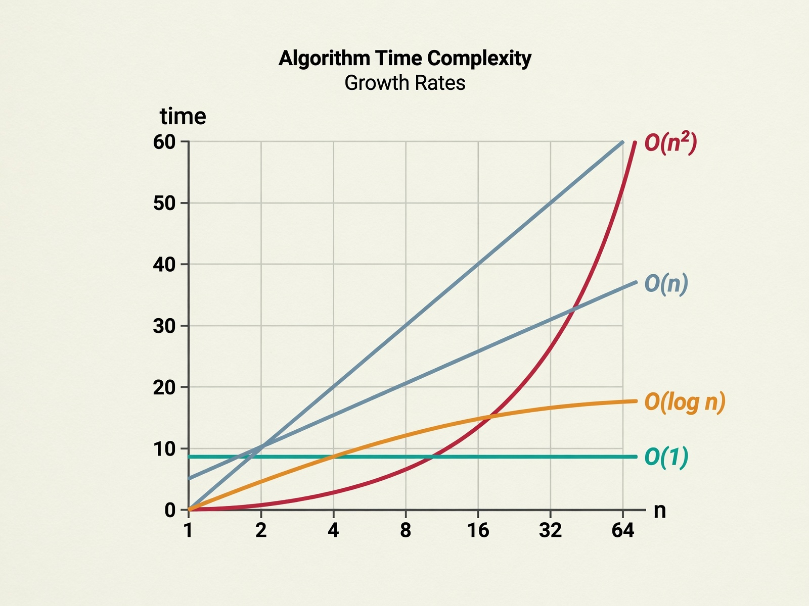
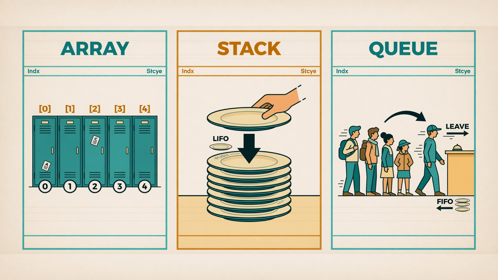
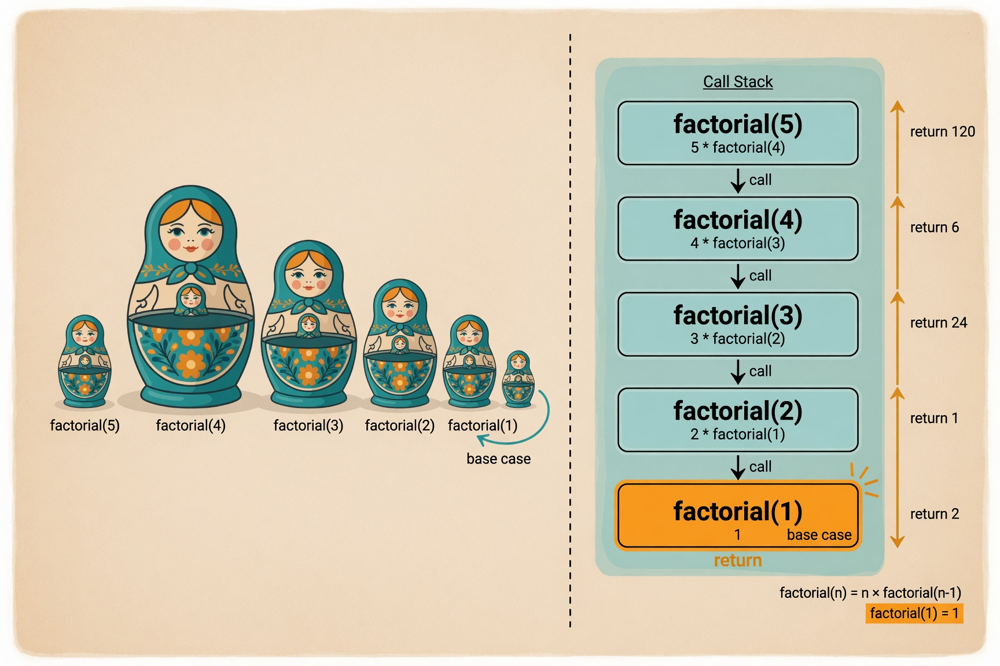
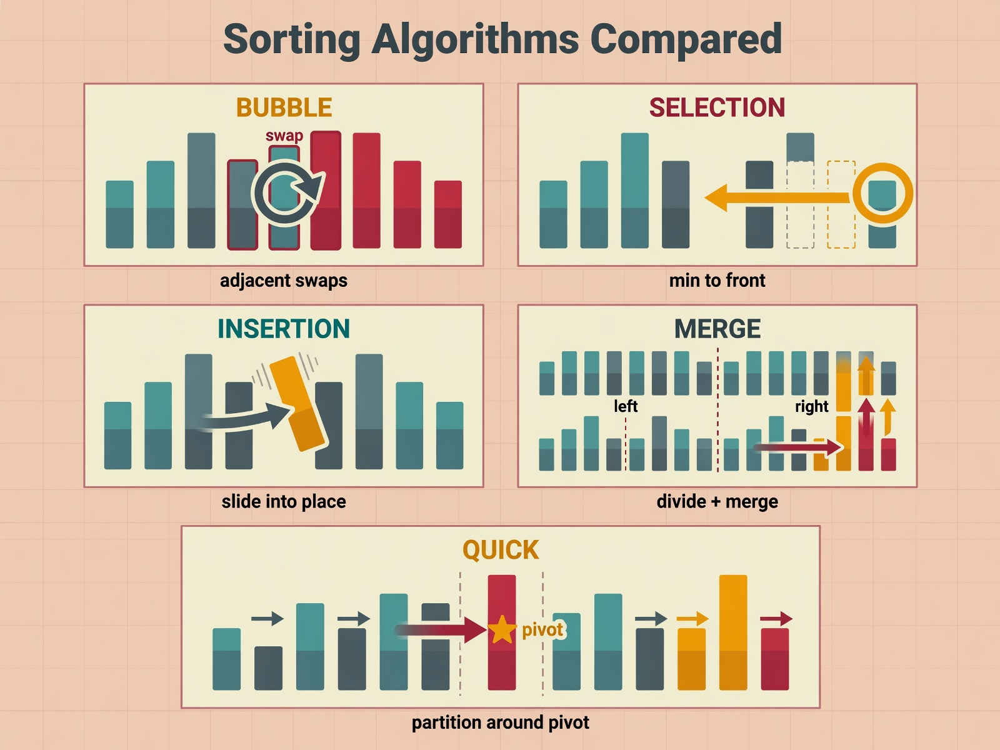
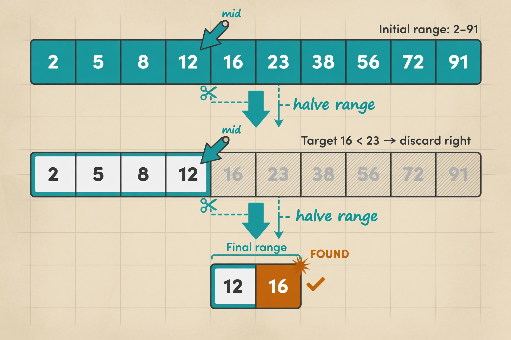

# 📚 ملخص مبسط لهياكل البيانات
> Data Structures - Simplified Summary
> من المحاضرات 1، 2، 4، 5 و 6

---

## الفصل 1: المقدمة ولغة الكفاءة

### ما هي هياكل البيانات؟
طريقة متخصصة لـ **تنظيم** و**تخزين** و**معالجة** البيانات **بكفاءة**.

### لماذا نحتاجها؟
بدونها:
- 🔴 بحث بطيء (فحص كل عنصر)
- 🔴 تحديث صعب (فوضى في الإدراج والحذف)
- 🔴 هدر في الذاكرة

### ثلاثة هياكل أساسية

| الهيكل | التشبيه | المبدأ |
|--------|---------|--------|
| المكدّس Stack | كومة أطباق | LIFO (آخر داخل أول خارج) |
| الطابور Queue | طابور بنك | FIFO (أول داخل أول خروج) |
| المصفوفة Array | خزائن مرقمة | وصول مباشر بالفهرس |

### النوع المجرّد ADT
**ADT = الفكرة** (ماذا يفعل؟)  
**هيكل البيانات = التنفيذ** (كيف يُبنى؟)

> تشبيه: الريموت كنترول — تعرف وظيفة كل زر دون معرفة الدائرة الكهربائية.

### ترميز Big-O
يصف أداء الخوارزمية في **أسوأ حالة**.

| الترميز | المعنى | مثال |
|---------|--------|------|
| O(1) | ثابت | الوصول لفهرس مصفوفة |
| O(log n) | لوغاريتمي | البحث الثنائي |
| O(n) | خطي | بحث عنصر عنصر |
| O(n log n) | خطي لوغاريتمي | Merge Sort |
| O(n²) | تربيعي | Bubble Sort |

*عند مليون عنصر: الخطية = مليون عملية، اللوغاريتمية = 20 عملية فقط!*

---

## الفصل 2: الهياكل الخطية

### المصفوفة Array

| العملية | التعقيد | السبب |
|--------|---------|-------|
| الوصول | O(1) | ذاكرة متصلة — حساب مباشر |
| البحث | O(n) | فحص عنصر عنصر |
| الإدراج | O(n) | إزاحة العناصر |
| الحذف | O(n) | إزاحة العناصر |

### المكدّس Stack (LIFO)
- **Push**: أضف للقمة
- **Pop**: أزل من القمة
- **Peek**: شاهد القمة

### الطابور Queue (FIFO)
- **Enqueue**: أضف للمؤخرة
- **Dequeue**: أزل من المقدمة
- **Front**: شاهد الأول

> كلا العمليتين (Enqueue/Dequeue) = O(1) ✅

---

## الفصل 3: العَوْدَة Recursion

### التعريف
الدالة تستدعي **نفسها** لحل نسخة **أصغر** من المشكلة.

### الركnan الأساسيان
1. **حالة الأساس** (Base Case): شرط التوقف
2. **الحالة العَوْدِية** (Recursive Case): نسخة أصغر

### القواعد الذهبية
- ✅ يجب وجود حالة أساس
- ✅ تقليص المشكلة كل استدعاء
- ✅ الاقتراب من شرط التوقف

> ⚠️ بدون حالة أساس = **Stack Overflow** = انهيار البرنامج!

### العَوْدَة vs التكرار

| المعيار | العَوْدَة | التكرار |
|---------|----------|---------|
| الأنسب | شجرات/هرميات | مهام خطية |
| الكود | أقصر | أطول |
| الذاكرة | أكثر | أقل |

---

## الفصل 4: الفرز والبحث

### خوارزميات الفرز

| الخوارزمية | الفكرة | التعقيد | الذاكرة |
|-----------|--------|---------|---------|
| Bubble | قارن الجارين وبدّل | O(n²) | O(1) |
| Selection | الأصغر للبداية | O(n²) | O(1) |
| Insertion | أدخل بموضعه | O(n²) | O(1) |
| Merge | قسّم، رتّب، ادمج | O(n log n) | O(n) |
| Quick | محور وقسّم | O(n log n)* | O(log n) |

> *Quick Sort: الأسرع عملياً، لكن أسوأ حالاته O(n²)

### البحث

#### البحث الخطي O(n)
- فحص عنصر عنصر
- لا يحتاج ترتيب

#### البحث الثنائي O(log n)
- يتطلب **مصفوفة مرتبة**
- قارن المنتصف → تخلَّ عن النصف
- مليون عنصر = **20 مقارنة فقط!**

### بحث الرسوم البيانية
- **BFS** (عرض): طابور، مستوى مستوى — O(V+E)
- **DFS** (عمق): مكدّس، يغوص في الفرع — O(V+E)

---

## الفصل 5: ورقة الغش 📝

### نقاط لا تنساها
1. المصفوفة: وصول O(1)، بحث O(n)
2. Stack = LIFO | Queue = FIFO
3. العَوْدَة بلا base case = 💥 Stack Overflow
4. البحث الثنائي ← **بيانات مرتبة فقط**
5. Merge Sort = ضمان O(n log n)
6. Quick Sort = الأسرع عملياً

### جدول التعقيد الشامل

| الهيكل | الوصول | البحث | الإدراج | الحذف |
|--------|--------|-------|---------|-------|
| Array | O(1) | O(n) | O(n) | O(n) |
| Stack | - | O(n) | O(1) | O(1) |
| Queue | - | O(n) | O(1) | O(1) |

| الخوارزمية | أفضل | أسوأ | الذاكرة |
|-----------|------|------|---------|
| Bubble | O(n) | O(n²) | O(1) |
| Selection | O(n²) | O(n²) | O(1) |
| Insertion | O(n) | O(n²) | O(1) |
| Merge | O(n log n) | O(n log n) | O(n) |
| Quick | O(n log n) | O(n²) | O(log n) |
| Binary Search | O(1) | O(log n) | O(1) |

### كيف تختار في الامتحان؟
- **أقل ذاكرة** → Bubble/Selection/Insertion (O(1))
- **ضمان السرعة** → Merge Sort (O(n log n) دائماً)
- **الأسرع عملياً** → Quick Sort (في أغلب الحالات)
